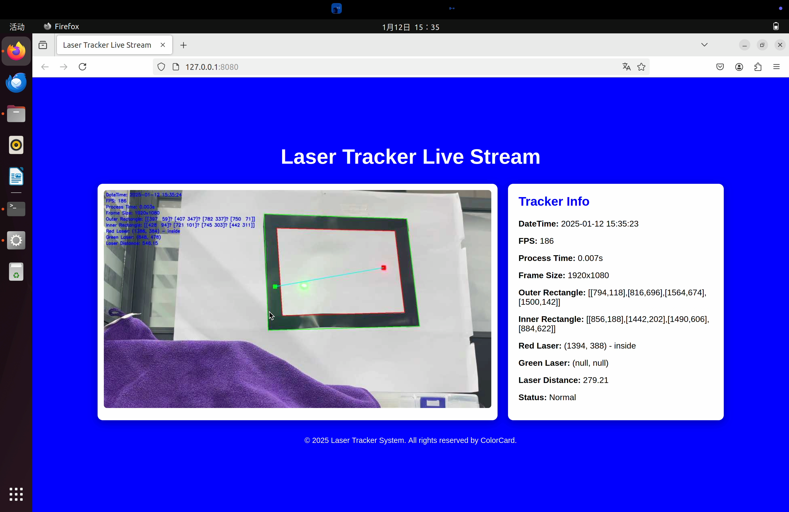

## 基于 OpenCV - Python 的红绿激光和矩形
基于 OpenCV-Python 的红绿激光和矩形识别以及判断，支持多线程、单线程，GUI、Web调试界面，支持串口通信，可以实时输出红绿激光光点坐标，矩形四个角点坐标，红绿激光光点坐标之差，红绿激光光点重合提醒信息。

本项目遵循 **MIT** 开源协议，欢迎大家使用，觉得有用的话留下一个 **Star⭐** ️吧！。

### 实现效果：


### 约束条件:
1. 取一张 A4 白纸将四周贴上黑色胶带
2. 两只红绿激光光笔
3. 免驱 USB 摄像头一个

### 完成目标:
- [x] 全程使用 USB 摄像头采集图像信息，并在电脑 Ubuntu 虚拟机端完成任务
- [x] 输出黑色矩形（A4 纸放置时需斜放，且不在摄像头正前方）四个角点坐标，并将黑框内外测均画上方框线，并使用有线/无线串口将这四个点坐标发送至 STM32 并在 32 的 OLED 上显示出来
- [x] 打开红色激光并控制红色激光光点沿着黑色胶带（尽量不可出胶带边界）走一圈，实时输出红色激光光点坐标，并将红色激光光点使用 cv 函数标红，在视频输出处需实时打印红色激光光点与黑色胶带框的位置关系（between, outside, inside）
- [x] 实时输出绿色激光光点与红色激光光点的坐标之差，并将绿色激光光点使用 cv 函数标绿，当红色激光光点与绿色激光光点重合时输出重合提醒信息

---

### 文件解释：

#### 配置文件：

##### [hsv_values.json](hsv_values.json)  
- HSV存储文件，程序运行时会读取该文件中的HSV值，在GUI界面或Web界面中可以调整HSV值
- GUI界面调整后按`S`会自动保存到该文件中，Web界面请点击保存按钮。
##### [setting.json](setting.json)
- 设置文件，程序运行时会读取该文件中的设置：
```json
{
  "url": 2,
  "hsv_config_path": "hsv_values.json",
  "serial_port": "/dev/cu.usbserial-2140",
  "baud_rate": 115200,
  "timeout": 1,
  "scale_percent": 50,
  "color": 1
}
```
    url: 摄像头设备号
    hsv_config_path: HSV存储文件路径
    serial_port: 串口号
    baud_rate: 波特率
    timeout: 超时时间
    scale_percent: 缩放比例
    color: 可以调整色彩空间RGB和BGR互换（可取值为0和1，此选项为了解决Linux色彩异常问题，可以不用改）

#### 运行程序：

##### [main.py](main.py)
- 单线程 **OpenCV GUI** 界面

##### [MultThread_Main.py](MultThread_Main.py)
- 多线程 **OpenCV GUI** 界面

##### [Debug_Main.py](Debug_Main.py)
- 多线程 **OpenCV GUI** 界面，增加了调试功能，可以观察不同颜色的HSV阈值限定效果。

##### [stream.py](stream.py)
- 多线程 **Web** 界面，使用**Flask**框架推流到网页，并实时显示摄像头画面和参数信息。

##### [stream_debug.py](stream_debug.py)
- 多线程 **Web** 界面，增加了调试功能，可以观察不同颜色的HSV阈值限定效果。

#### STM32程序：
##### [STM32_Part](STM32_Part)
- 基于STM32C8T6的OLED显示程序，用于接收串口数据并在OLED上显示。


#### 测试程序：
##### [serial_test.py](serial_test.py)
- 串口测试程序，用于测试串口是否正常连接。

##### [test.py](test.py)
- 测试程序，用于测试摄像头是否正常连接。

